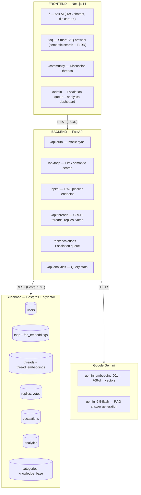
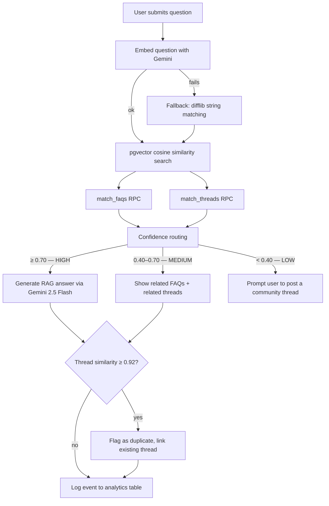
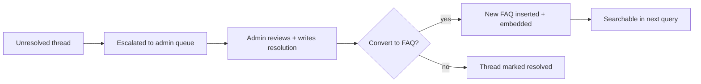

<div align="center">

# 🎓 Samagama FAQ — Knowledge OS
### AI-Powered Internship Help Platform · IIT Ropar / Vicharanashala

**[Live Demo →](https://samagama-faq-alpha.vercel.app/)**


</div>

---

## What is this?

Samagama FAQ is a self-evolving, AI + community-powered knowledge operating system built for the [Vicharanashala Internship](https://vicharanashala.org/) at IIT Ropar. It replaces the old static FAQ page and chaotic #escalate workflow with a layered system that gets smarter every day:

- **Semantic FAQ search** — vector embeddings find the right answer even when the wording differs
- **RAG AI assistant** — Gemini answers questions using only verified content, never hallucinating
- **Community discussions** — Reddit/StackOverflow-style threads with upvotes, accepted answers, and mentor badges
- **Smart escalation** — admin queue is a last resort, not the first one
- **Knowledge promotion** — resolved escalations can become official FAQs in one click

---

## Architecture



### How a question flows through the system



### RAG pipeline (no-hallucination guarantee)

1. Retrieve top-k matches from `faq_embeddings` + `thread_embeddings` via pgvector
2. Build a context block from verified FAQ answers and accepted community replies
3. Send context + question to Gemini with strict instructions:
   - Answer **only** from context
   - Cite source (`[FAQ: …]`)
   - If uncertain → say so, don't guess
4. If Gemini is unavailable → extract first answer from context text (zero-API fallback)

### Knowledge promotion loop



---

## Project structure

```
samagama-faq/
├── backend/
│   ├── .env                    # Runtime secrets (gitignored)
│   ├── .env.example            # Template — copy to .env and fill in
│   ├── requirements.txt
│   └── app/
│       ├── main.py             # FastAPI app + CORS middleware
│       ├── api/
│       │   ├── auth.py         # /api/auth — profile sync
│       │   ├── faqs.py         # /api/faqs — list + semantic search
│       │   ├── ai.py           # /api/ai/ask — RAG pipeline
│       │   ├── discussions.py  # /api/threads — CRUD + voting
│       │   ├── escalations.py  # /api/escalations — queue management
│       │   └── analytics.py    # /api/analytics — stats
│       ├── core/
│       │   ├── config.py       # Pydantic settings (reads .env)
│       │   ├── database.py     # Supabase REST helpers (get/post/patch/delete/rpc)
│       │   └── security.py     # Auth/role helpers (currently open access)
│       ├── models/
│       │   ├── user.py         # UserProfile schema
│       │   ├── faq.py          # FAQ schema
│       │   └── thread.py       # Thread, Reply, Vote schemas
│       └── services/
│           ├── embedding_service.py  # Gemini embedding-001 wrapper (with retry)
│           └── rag_service.py        # Full RAG pipeline + local fallback
│
├── frontend/
│   ├── .env.example            # Template for NEXT_PUBLIC_* vars
│   ├── next.config.mjs
│   ├── tailwind.config.ts
│   └── src/
│       ├── app/
│       │   ├── page.tsx            # Home / Ask AI (flip card UI)
│       │   ├── faq/page.tsx        # Smart FAQ browser
│       │   ├── community/
│       │   │   ├── page.tsx        # Thread list + create
│       │   │   ├── [id]/page.tsx   # Thread detail + replies
│       │   │   ├── store.ts        # localStorage thread store
│       │   │   └── types.ts        # ForumView, ForumTopic types
│       │   ├── admin/page.tsx      # Admin dashboard
│       │   └── ask-ai/page.tsx     # Redirect → /
│       ├── components/
│       │   ├── navbar.tsx
│       │   └── route-aware-shell.tsx
│       ├── data/
│       │   └── campus-faq.ts       # Static FAQ data + topic config
│       ├── lib/
│       │   ├── supabase.ts         # Supabase client
│       │   └── tldr.ts             # AI TLDR generator for FAQ cards
│       └── services/
│           └── api.ts              # All backend API calls
│
├── faq.json                    # Source FAQ dataset (used by ingest script)
├── tldr.json                   # Pre-generated TLDR summaries
└── backend/scripts/
    ├── ingest_faqs.py          # One-time FAQ ingestion → Supabase + embeddings
    └── test_rag.py             # Manual RAG pipeline smoke test
```

---

## Local setup guide

### Prerequisites

| Tool | Version | Install |
|------|---------|---------|
| Python | 3.11+ | [python.org](https://python.org) |
| Node.js | 18+ | [nodejs.org](https://nodejs.org) |
| Git | any | [git-scm.com](https://git-scm.com) |

You also need accounts for:
- [Supabase](https://supabase.com) — free tier is enough
- [Google AI Studio](https://aistudio.google.com) — for Gemini API key (free quota)

---

### 1. Clone the repo

```bash
git clone https://github.com/Bhavya-jain07/samagama-faq.git
cd samagama-faq
```

---

### 2. Set up Supabase

1. Create a new Supabase project at [app.supabase.com](https://app.supabase.com)
2. Go to **Project Settings → API** and copy:
   - `Project URL` → `SUPABASE_URL`
   - `anon public` key → `SUPABASE_KEY` / `NEXT_PUBLIC_SUPABASE_ANON_KEY`
3. Enable the **pgvector** extension:
   ```sql
   -- Run in Supabase SQL Editor
   create extension if not exists vector;
   ```
4. Run the database schema (ask the project maintainer for the full schema SQL, or check the project wiki).

---

### 3. Get a Gemini API key

1. Go to [aistudio.google.com/app/apikey](https://aistudio.google.com/app/apikey)
2. Create an API key — paste it as `GEMINI_API_KEY`

> **No Gemini key?** The app still works. Semantic search falls back to difflib string matching and the AI answer falls back to extracting the first FAQ answer from context. You just won't get vector search or AI-generated answers.

---

### 4. Backend

```bash
cd backend

# Copy and fill in environment variables
cp .env.example .env
# Edit .env with your Supabase URL, key, and Gemini API key

# Create a virtual environment
python -m venv venv
source venv/bin/activate      # Windows: venv\Scripts\activate

# Install dependencies
pip install -r requirements.txt

# Run the server
uvicorn app.main:app --reload --port 8000
```

The API will be live at `http://localhost:8000`.
Interactive docs: `http://localhost:8000/docs`

---

### 5. Ingest the FAQ dataset

Run this once to load `faq.json` into Supabase and generate embeddings:

```bash
# Still inside the backend/ directory with venv active
python scripts/ingest_faqs.py
```

This will:
- Parse `faq.json`
- Insert FAQ records into `faqs` table
- Generate 768-dim Gemini embeddings for each question+answer
- Store them in `faq_embeddings` (pgvector)

> Tip: If you hit Gemini rate limits, the script has built-in retry + sleep. Let it run.

---

### 6. Frontend

```bash
cd frontend

# Copy and fill in environment variables
cp .env.example .env.local
# Edit .env.local — set NEXT_PUBLIC_API_URL, SUPABASE_URL, and SUPABASE_ANON_KEY

# Install dependencies
npm install

# Start the dev server
npm run dev
```

The app will be live at `http://localhost:3000`.

---

### 7. Verify everything works

1. Open `http://localhost:3000` — you should see the Ask AI card
2. Type a question and hit **Ask AI** — it should call the backend and return results
3. Open `http://localhost:3000/faq` — FAQ cards should load
4. Check backend logs (`uvicorn` terminal) for any errors

---

## Deployment

### Frontend → Vercel

```bash
# Push to GitHub, then connect the repo in Vercel
# Set these environment variables in Vercel Project Settings:
NEXT_PUBLIC_API_URL=https://your-backend.railway.app/api
NEXT_PUBLIC_SUPABASE_URL=https://your-project.supabase.co
NEXT_PUBLIC_SUPABASE_ANON_KEY=your-anon-key
```

### Backend → Railway / Render

**Railway:**
1. Create new project → Deploy from GitHub repo
2. Set root directory to `backend/`
3. Set start command: `uvicorn app.main:app --host 0.0.0.0 --port $PORT`
4. Add all environment variables from `.env`

**Render:**
1. New Web Service → connect GitHub repo
2. Root directory: `backend`
3. Build command: `pip install -r requirements.txt`
4. Start command: `uvicorn app.main:app --host 0.0.0.0 --port $PORT`

> After deploying the backend, update `NEXT_PUBLIC_API_URL` in Vercel to point to the production URL.

---

## Environment variables reference

### Backend (`backend/.env`)

| Variable | Required | Description |
|----------|----------|-------------|
| `SUPABASE_URL` | ✅ | Your Supabase project URL |
| `SUPABASE_KEY` | ✅ | Supabase anon key (service key for admin scripts) |
| `GEMINI_API_KEY` | ⚠️ | Gemini API key. Falls back to string matching if blank |
| `PORT` | ❌ | Server port (default: `8000`) |

### Frontend (`frontend/.env.local`)

| Variable | Required | Description |
|----------|----------|-------------|
| `NEXT_PUBLIC_API_URL` | ✅ | Backend API base URL, e.g. `http://localhost:8000/api` |
| `NEXT_PUBLIC_SUPABASE_URL` | ✅ | Supabase project URL |
| `NEXT_PUBLIC_SUPABASE_ANON_KEY` | ✅ | Supabase anon key |

---

## API reference

| Method | Endpoint | Description |
|--------|----------|-------------|
| `GET` | `/api/faqs` | List FAQs (optional `?category=slug`) |
| `GET` | `/api/faqs/categories` | List all categories |
| `GET` | `/api/faqs/search?q=...` | Semantic search FAQs |
| `POST` | `/api/ai/ask` | RAG AI answer |
| `GET` | `/api/threads` | List threads |
| `POST` | `/api/threads` | Create thread |
| `GET` | `/api/threads/:id` | Get thread + replies |
| `POST` | `/api/threads/:id/replies` | Reply to thread |
| `POST` | `/api/threads/vote` | Upvote/downvote |
| `POST` | `/api/threads/:id/accept-reply` | Accept reply |
| `GET` | `/api/escalations` | List escalation queue |
| `POST` | `/api/escalations` | Escalate a thread |
| `POST` | `/api/escalations/:id/resolve` | Resolve / convert to FAQ |
| `GET` | `/api/analytics` | Platform analytics |
| `GET` | `/api/auth/profile` | Current user profile |

> **Note on auth:** Role/permission checks (`Mentor`/`Admin`-only routes) are currently disabled — all endpoints are open. The auth scaffolding (Supabase JWT, roles, reputation) still exists in the codebase for future use, but no login UI is wired up yet.

Full interactive docs available at `/docs` when the backend is running.

---

## Known limitations / roadmap

- **Community page** currently uses `localStorage` as its data store — threads don't sync across devices or users. Migrating to the backend `/api/threads` endpoints is the next planned work item.
- **Auth & roles** exist in the backend (Supabase Auth, Student/Mentor/Admin roles, reputation points) but are not enforced and have no frontend UI. All routes are currently open/guest-accessible.
- **pgvector RPC functions** (`match_faqs`, `match_threads`) must be created in Supabase before vector search works — see the schema SQL in the project wiki.
- **Rate limiting** is not yet implemented on the backend. Add it before exposing the API publicly.

---

## License

MIT — see [LICENSE](LICENSE).

---

<div align="center">
Built with ❤️ for the Vicharanashala Internship · IIT Ropar
</div>
